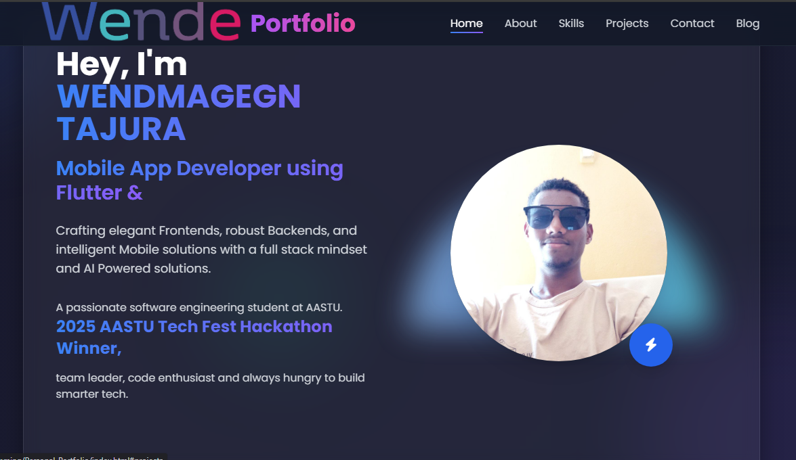

# Wendmagegn Tajura - Personal Portfolio




Welcome to my personal portfolio! This portfolio is built using HTML, CSS, JavaScript, and showcases my skills, projects, achievements, and interests as a software engineer. It's designed to provide an interactive and engaging experience, with features such as smooth scroll animations, interactive elements, and detailed project showcases.

## 🚀 Features

- **Responsive Design**: The portfolio is fully responsive and adapts to mobile and desktop views seamlessly.
- **Scroll Animations**: Smooth animations when sections are revealed as you scroll down.
- **Project & Hackathon Highlights**: Showcases my key achievements including the 2025 AASTU TechFest Hackathon and other notable events.
- **Interactive Contact Form**: A contact form that allows users to easily get in touch with me. (With integration to FormSubmit for email handling)
- **Skills & Projects Section**: Displays the skills I've gained throughout my career, with a portfolio of projects I've worked on.
- **Testimonial Section**: Includes testimonials that showcase feedback from my hackathon teammates.

## 🔧 Technologies Used

- **HTML5** for structure
- **CSS3** (TailwindCSS) for styling
- **JavaScript** for interactivity (Scroll Animations, Form Handling)
- **Font Awesome** for icons
- **FormSubmit** for email handling on the contact form

## 📦 Installation

To run this portfolio locally, follow these steps:

1. **Clone the repository** to your local machine:
    ```bash
    git clone https://github.com/yourusername/portfolio.git
    ```

2. **Navigate into the project directory**:
    ```bash
    cd portfolio
    ```

3. **Open the `index.html` file** in your browser to view your portfolio locally.

## ⚙️ Customization

1. **Change Your Information**:
    - Open `index.html` and modify the content inside the appropriate sections to reflect your personal information.
    - Update the contact form's recipient email address by using a service like [FormSubmit](https://formsubmit.co) and setting it in the form's `action` attribute.

2. **Update Projects & Achievements**:
    - Edit the project and achievement sections in the HTML files to display your own projects, hackathons, and other experiences.
    - Modify the skill icons in the "Skills" section by adding the relevant technologies you are proficient in.

## 🌱 Future Improvements

- **Dark/Light Mode**: Add a toggle for users to switch between dark and light modes for improved accessibility.
- **Blog Section**: Integrate a CMS or markdown-based blog system to manage blog posts dynamically.
- **Enhanced Animations**: Experiment with more advanced animations and transitions to create a more engaging user experience.

## 📝 License

This project is open source and available under the [MIT License](LICENSE).

## 🙋‍♂️ About Me

Hi, I'm **Wendmagegn Tajura** - a passionate software engineer and problem solver. I'm always open to learning, collaborating, and growing with like-minded individuals. My goal is to work on projects that make a real-world impact, and I'm constantly seeking new challenges to improve my skills.

Check out my social profiles and feel free to reach out to me!

- [LinkedIn](https://www.linkedin.com/in/wendmagegn-tajura)
- [GitHub](https://github.com/wende12github)
